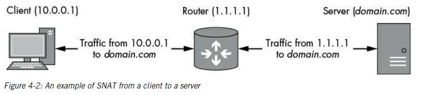
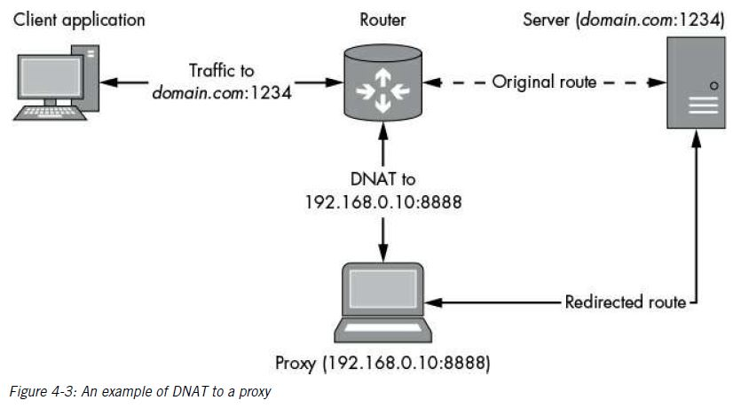

# Advance Traffic Capturing

Sometimes you come up with tricky situations that require some more advance ways

## Routing Traffic

IP is a routed protocol; that is, none of the nodes on the network need to know the exact location of any other nodes. When two nodes send traffic to each other they use gateway to send the traffic. A gateway is more commonly known as the router.

To trace the route, `Traceroute` is commonly used or `tracert` in Windows.
`$ tarceroute www.google.com`

Each IP address shown is the gateway the traffic is routed before reaching its destination. The total number of IP refers to the total number of *hops*. The time shown in ms is the total round trip time from machine performing the traceroute and the discovered node.

## Routing Tables

The OS uses routing tables to figure out which gateways to send traffic to. A routing table contains a list of destination networks and the gateway to route traffic to.
To see the routing table on linux `netstat -r` is used.

what happens to traffic when the gateway responsible for communicating with the destination network isn’t known? In that case, it’s common for the routing table to forward all unknown traffic to a default gateway( 0.0.0.0 ).

If we don't have access to an operating system to capture it's traffic, we can use our device as a gateway between system and it's destination.

### Configuring the Router

If routing is not enabled in the OS configuration, any traffic sent to one of the machine’s network interfaces that needs to be routed is instead dropped or an error message is sent to the sender. The default configuration is very important for security: imagine the implications if the router controlling your connection to the internet routed traffic from the internet directly to your private network.
To enable routing in Linux:
`sudo sysctl net.ipv4.conf.all.forwarding=1` for IPv4
`sudo sysctl net.ipv6.conf.all.forwarding=1` for IPv6
To revert the changes:
`sudo sysctl -w net.inet.ip.forwarding=1`

## Network Address Translation

When trying to capture traffic, you may find that you can capture outbound traffic but not returning traffic. The reason is that an upstream router doesn’t know the route to the original source network; therefore, it either drops the traffic entirely or forwards it to an unrelated network. You can mitigate this situation by using Network Address Translation (NAT), a technique that modifies the source and destination address information of IP and higher-layer protocols, such as TCP.
When NAT is turned on, you can run as many devices behind a single NAT IP address as you like and manage only that public IP address.
2 types of NAT

1. SNAT
2. DNAT

### SNAT

SNAT changes the IP source address information. When you want a router to hide multiple machines behind a single IP address, you use SNAT.
It can be useful to implement SNAT when you want to route traffic to a network that you don't control.

If client send a request to *www.domain.com* through an IP addr of 192.168.10.1, the request goes to the router with IP addr 1.1.1.1 changes the source IP addr to 1.1.1.1 and stores the client IP addr to a table and sends the request to www.domain.com. When the server send back the response. It sends to destination IP 1.1.1.1, the request comes back to router which changes the dest IP addr to 192.168.10.1 and send to the client.
To configure SNAT on Linux:

1. Enable IP routing
2. Find the name of the outbound network interface on which you want to configure SNAT using `ifconfig` command.
3. Note the IP address associated with the outbound interface when you use ifconfig.
4. Now configure NAT rules using the `iptables` after flushing any NAT existing rules by `sudo iptables -t nat -F`.
5. If the outbound network interface has a fixed address, run the following commands as root to enable SNAT. Replace *INTNAME* with the name of your outbound interface and *INTIP* with the IP address assigned to that interface. `sudo iptables -t nat -A POSTROUTING -o INTNAME -j SNAT --to INTIP`.
6. If the IP address is configured dynamically (perhaps using DHCP or a dial-
   up connection), use the following command to automatically determine the outbound IP
   address: `sudo iptables -t nat -A POSTROUTING -o INTNAME -j MASQUERADE`.

### DNAT

DNAT is useful if you want to redirect traffic to a proxy or other service to terminate it, or before forwarding the traffic to its original destination. DNAT rewrites the destination IP address, and optionally, the destination port. You can use DNAT to redirect specific traffic to a different destination, as shown in Figure 4-3, which illustrates traffic being redirected from both the router and the server to a proxy at 192.168.0.10 to perform a man-in-the-middle analysis.

To configure DNAT on machine:

1. Flush NAT rules : `sudo iptables -t nat -F`
2. `sudo iptables -t nat -A PREROUTING -d ORIGIP -j DAT --to-destination NEWIP` replace NEWIP with the new IP addr you want to redirect traffic.
3. To apply the rule only to a specific TCP or UDP, change the command: `iptables -t nat -A PREROUTING -p PROTO -d ORIGIP --dport ORIGPORT -j DNAT --to-destination NEWIP:NEWPORT`. The placeholder PROTO (for protocol) should be either tcp or udp.

## Forwarding Traffic to a Gateway

You can’t easily change the network configuration of the device you want to capture. Also, you have limited ability to change the network configuration the device is connected to. You need some way to reconfigure or trick the sending device into forwarding traffic through your gateway. You could accomplish this byexploiting the local network by spoofing packets for either DHCP or Address Resolution Protocol (ARP).

### DHCP Spoofing

if we can spoof DHCP traffic, we can change a node’s network configuration remotely. When DHCP is used, the network configuration pushed to a node can include an IP address as well as the default gateway, routing tables, the default DNS servers, and even additional custom parameters.
The interesting aspect of DHCP is that it uses an unauthenticated, connectionless protocol to perform configuration. Even if an existing DHCP server is on a network, you may be able to spoof the configuration process and change the node’s network configuration, including the default gateway address, to one you control. This is called DHCP spoofing.
To perform DHCP spoofing, we’ll use Ettercap,
`sudo ettercap -G`
Configure Ettercap’s sniffing mode by selecting *Sniff ▸ Unified Sniffing*.
Enable DHCP spoofing by choosing *Mitm ▸ Dhcp spoofing*.
