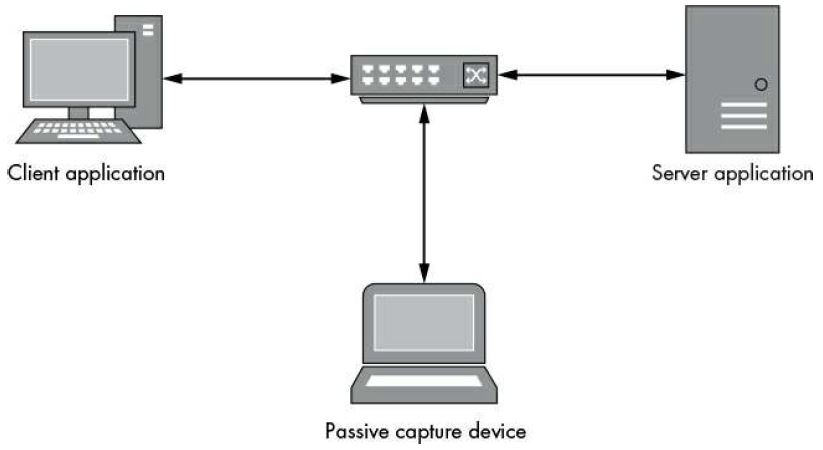
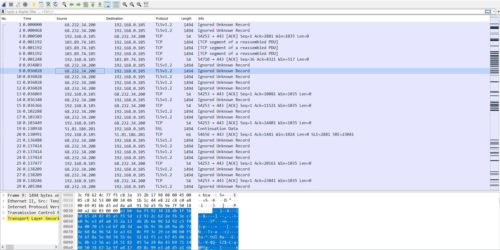
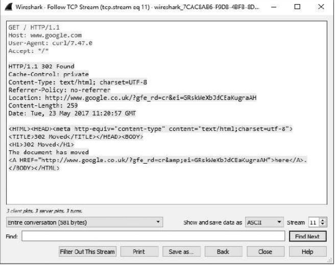
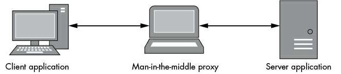
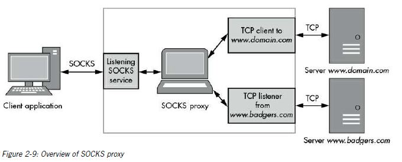

# Capturing Application Traffic

There are 2 types of capture techniques:

1. **Passive:** It doesn't directly interact with the traffic. Instead, it extracts the data as it travels on the wire, which should be familiar from tools like Wireshark.
2. **Active**: It interferes with traffic between a client application and the server; this has great power but can cause some complications. It is like a proxy or even a man in the middle attack.

## *Passive Traffic Capture:*



    The picture shows a client and server communicating over a network using ethernet. Passive network capture can take place either on the network by tapping the traffic as it passes in some way or by sniffing directly on either the client or server host.

    Wireshark is used to sniff traffic from the network. It is cross platform and easy to use with lots of features for protocol analysis.

    To capture traffic from an Ethernet interface (wired or wireless), the capturing device must be in promiscuous mode. A device in promiscuous mode receives and processes any Ethernet frame it sees, even if that frame wasn't destined for that interface. Capturing an application running on the same computer is easy; just monitor the outbound network
interface or the local loopback interface (better known as localhost).

The picture below shows the captured traffic on wireshark.



    The captured traffic shows the destination IP and the source IP as well as the protocol used. The area which is highlighted blue in the picture shows the packet in it's raw form.

    The TCP network protocol is stream based and designed to recover from dropped packets or data corruption. Due to the nature of networks and IP, there is no guarantee that packets will be received in a particular order. Therefore, when you are capturing packets, the timeline view might be difficult to interpret. Fortunately, Wireshark offers dissectors for known protocols that will normally reassemble the entire stream and provide all the information in one place. For example, highlight a packet in a TCP connection in the timeline view and then select Analyze ▸ Follow TCP Stream from the main menu. A dialogue similar to picture below will appear.



### Alternative Passive Capture Techniques

    Sometimes using a packet sniffer isn't appropriate, for example, in situations when you don't have permission to capture traffic. You might be doing a penetration test on a system with no administrative access or a mobile device with a limited privilege shell. There are few techiques:

#### System Call Tracing

    Many modern operating systems provide two modes of execution. Kernel mode runs with a high level of privilege and contains code implementing the OS's core functionality. User
mode is where everyday processes run. The kernel provides services to user mode by exporting a collection of special system calls, allowing users to access files, create processes—and most important for our purposes—connect to networks.

    Most Unix-like systems implement system calls resembling the Berkeley Sockets model for network communication. The table shows

| Name                            | Description                                                                                                                                                                 |
| ------------------------------- | --------------------------------------------------------------------------------------------------------------------------------------------------------------------------- |
| socket                          | Creates a new socket file descriptor                                                                                                                                        |
| connect                         | Connects a socket to a known IP address and port.                                                                                                                           |
| bind                            | Binds the socket to a local known IP address and port                                                                                                                       |
| recv,<br />read,<br />recvfrom  | Receives data from the network via the socket. The generic function read is for reading from a file descriptor, whereas recv and recvfrom are specific to the socket's API |
| send,<br />write,<br />sendfrom | Sends data over the network via the socket.                                                                                                                                 |

#### The strace Utility of Linux

    In Linux, you can directly monitor system calls from a user program without special permissions, unless the application you want to monitor runs as a privileged user. Many Linux distributions include the handy utility strace, which does most of the work for you.

    Run the following command replacing`/path/to/app` with application path of application and `args `with necessary parameters.  

`$ strace -e trace=network,read,write /path/to/app args`

Let's monitor an app that reads and writes few strings and look at output of `strace` command. 

`$ strace -e trace=network,read,write ./app`

The block belows shows the output of the command with some logging removed. 

```c
socket(PF_INET, SOCK_STREAM, IPPROTO_TCP) = 3
connet(3, {sa_family= AF_INET, sin_port=htons(5555),
	sin_addr=inet_addr("192.168.0.1")}, 16) = 0
write(3, "Hello World!\n", 13) = 13
read(3, "BOO!\n", 2048)
```

    The first entry at line 1 creates a new TCP socket, which is assigned the handle 3. The next entry at line 2 shows the connect system call used to make a TCP connection to IP address 192.168.10.1 on port 5555. The application then writes the string Hello World! at line 3 before reading out a string Boo! at line 4.

#### Monitoring Network Connections with DTrace

DTrace is a very powerful tool available on many Unix-like systems. It allows you to set systemwide probes on special trace providers, including system calls. You configure DTrace by writing scripts in a language with a C-like syntax. For more details on this tool, refer to the DTrace Guide online at [http://www.dtracebook.com/index.php/DTrace_Guide]().

    The code below shows a simple DTrace script to monitor a connect system call.

```c
struct sockaddr_in {
   short sin_family;
   unsigned short sin_port;
   in_addr_t sin_addr;
   char sin_zero[8];
}

syscall::connect::entry
/arg2 == sizeof(struct sockaddr_in)/
{
    addr = (struct sockaddr_in*)copyin(arg1,arg2);
    printf("process: '%s' %s:%d", execname, inet_ntop(2, &addr->sin_addr), ntohs(addr->sin_port));
}
```

    The script defines a sockaddr_in structure that is used for IPv4 connections at ➊; in many cases these structures can be directly copied from the system's C header files. The system call to monitor is specified at ➋. At ➌, a DTrace-specific filter is used to ensure we trace only connect calls where the socket address is the same size as sockaddr_in. At ➍, the sockaddr_in structure is copied from your process into a local structure for DTrace to inspect. At ➎, the process name, the destination IP address, and the port are printed to the console. To run this script copy it to a file called ***traceconnect.d** * and run the command: `dtrace -s traceconnect.d` as sudo. 

```cpp
process: 'Google Chrome'       173.194.78.125:5222
process: 'Google Chrome'       173.194.66.95:443
```

#### Process Monitor on Windows

    Windows implements its user-mode network functions
without direct system calls. The networking stack is exposed through a driver, and establishing a connection uses the file`open`, `read`, and `write `system calls to configure a network socket for use. Tool used to monitor system calls in called: `Windows Process monitor`

## Active Traffic Capture

    Active capture differs from passive in that you’ll try to influence the flow of the traffic, usually by using a man-in-the-middle attack on the network communication. As shown in
Figure below, the device capturing traffic usually sits between the client and server applications, acting as a bridge. This approach has several advantages, including the ability to modify traffic and disable features like encryption or compression, which can make it easier to analyze and exploit a network protocol.



### Network Proxies

The most common way to perform a man-in-the-middle attack on network traffic is to force the application to communicate through a proxy service.

#### Port-Forwarding Proxy

Port forwarding is the easiest way to proxy a connection. Just set up a listening server (TCP or UDP) and wait for a new connection. When that new connection is made to the proxy server, it will open a forwarding connection to the real service and logically connect the two. 

To create our proxy, we'll use the built-in TCP port forwarder included with the Canape Core libraries in C#.

```csharp
using static System.Console;
using static CANAPE.Cli.ConsoleUtils;

//create proxy template
var template = new FixedProxyTemplate();
template.LocalPort = 8080;
template.Host = "192.168.15.1";
template.Port = 80;

//Create proxy instance and start
var service = template.Create();
service.Start();

WriteLine("Created{0}", service);
WriteLine("Press enter to exit");
Readline();
service.Stop();

//Dump packets
var packets = service.Packets;
WriteLine("Captures{0} packets: ", packets.Count);
WritePackets(packets);

```

#### SOCKS Proxy

    Think of a SOCKS proxy as a port-forwarding proxy on steroids. Not only does it forward TCP connections to the desired network location, but all new connections start with a simple handshake protocol that informs the proxy of the ultimate destination rather than having it fixed. It can also support listening connections, which is important for protocols like File Transfer Protocol (FTP) that need to open new local ports for the server to send data to.



The Canape Core libraries have built-in support for SOCKS 4, 4a, and 5. Place Listing 2-6 into a C# script file, changing LOCALPORT ➋ to the local TCP port you want to listen on for the SOCKS proxy. Listing 2-6 follows the same pattern established with the TCP port-forwarding proxy in Listing 2-4. But in this case, the code at ➊ creates a SOCKS proxy template. The rest of the code is exactly the same.

```csharp
// SocksProxy.csx – Simple SOCKS proxy
// Expose methods like WriteLine and WritePackets
using static System.Console;
using static CANAPE.Cli.ConsoleUtils;

// Create the SOCKS proxy template
var template = new SocksProxyTemplate();
template.LocalPort = LOCALPORT;

// Create proxy instance and start
var service = template.Create();
service.Start();

WriteLine("Created {0}", service);
WriteLine("Press Enter to exit...");
ReadLine();
service.Stop();

// Dump packets
var packets = service.Packets;
WriteLine("Captured {0} packets:",
packets.Count);
WritePackets(packets);
```

    In addition, if the application just will not support a SOCKS proxy natively, certain tools will add that function to arbitrary applications. These tools range from free and open source tools, such as Dante (https://www.inet.no/dante/) on Linux, to commercial tools, such as Proxifier (https://www.proxifier.com/), which runs on Windows and macOS. In one way or another, they all inject into the application to add SOCKS support and modify the operation of the socket functions.

#### HTTP Proxies

    It can tunnel though the most restrictive firewalls. It is important to understand how HTTP proxying works in practice, because it will almost certainly be useful for protocol analysis, even if a web service is not being tested. Existing web application–testing tools rarely do an ideal job when HTTP is being used out of its original environment. Sometimes rolling your own implementation of an HTTP proxy is the only solution.

    The two main types of HTTP proxy are the forwarding proxy and the reverse proxy.

##### Forwarding an HTTP Proxy

    An example of HTTP 1.1 request line is`GET /image.jpg HTTP/1.1`

    In a proxy request, this does not change from a normal HTTP connection. The path`/image.jpg` is where the proxy request gets interesting. As is shown, an absolute path indicates the resource that the method will act upon. Importantly, the path can also be an absolute Uniform Request Identifier (URI). By specifying an absolute URI, a proxy server can establish a new connection to the destination, forwarding all traffic on and returning data back to the client. The proxy can even manipulate the traffic, in a limited fashion, to add authentication, hide version 1.0 servers from 1.1 clients, and add transfer compression along with all manner of other things. However, this flexibility comes with a cost: the proxy server must be able to process the HTTP traffic, which adds massive complexity. For example: `GET http://www.domain.com/image.jpg HTTP/1.1`

    An issue with this approach to proxying HTTP communication. Because the proxy must be able to access the underlying HTTP protocol, what about HTTPS, which transports HTTP over an encrypted TLS connection? You could break out the encrypted traffic; however, in a normal environment, it is unlikely the HTTP client would trust whatever certificate you provided. Also, TLS is intentionally designed to make it virtually impossible to use a man-in-the-middle attack any other way. Fortunately, this was anticipated, and RFC 2817 provides two solutions: it includes the ability to upgrade an HTTP connection to encryption (there is no need for more details here), and more importantly for our purposes, it specifies the CONNECT HTTP method for creating transparent, tunneled connections over HTTP proxies. As an example, a web browser that wants to establish a proxy connection to an HTTPS site can issue the following request to the proxy:

`CONNECT www.domain.com:443 HTTP/1.1`

    If proxy accepts this requests it will make a new TCP connection on the server and will send this response:

`HTTP/1.1 200 Connection Established`

The TCP connection to the proxy now becomes transparent, and the browser is able to establish the negotiated TLS connection without the proxy getting in the way. Of course, it's worth noting that the proxy is unlikely to verify that TLS is actually being used on this connection. It could be any protocol you like, and this fact is abused by some applications to tunnel out their own binary protocols through HTTP proxies.

The Canape Core libraries include a simple implementation of an HTTP proxy. Unfortunately, they don't support the CONNECT method to create a transparent tunnel, but it will suffice for demonstration purposes.

```csharp
// HttpProxy.csx – Simple HTTP proxy
// Expose methods like WriteLine and WritePackets
using static System.Console;
using static CANAPE.Cli.ConsoleUtils;

// Create proxy template
var template = new HttpProxyTemplate();
template.LocalPort = LOCALPORT;

// Create proxy instance and start
var service = template.Create();
service.Start();

WriteLine("Created {0}", service);
WriteLine("Press Enter to exit...");
ReadLine();
service.Stop();

// Dump packets
var packets = service.Packets;
WriteLine("Captured {0} packets:", packets.Count);
WritePackets(packets);
```

##### Reverse HTTP Proxy

    Sometimes you might want to proxy inbound connections, perhaps for load-balancing or security reasons (to prevent exposing your servers directly to the outside world). However, a problem arises if you do this. You have no control over the client. In fact, the client probably doesn't even realize it's connecting to a proxy. This is where the reverse HTTP proxy comes in.

    Instead of requiring the destination host to be specified in the request line, as with a forwarding proxy, you can abuse the fact that all HTTP 1.1–compliant clients must send a Host HTTP header in the request that specifies the original hostname used in the URI of the request. With the Host header information, you can infer the original destination of the request, making a proxy connection to that server, as shown :

`GET /image.jpg HTTP/1.1`

`User Agent: Super Funky HTTP Client v1.0`

`Host: www.domain.com`

`Accept: */*`

This shows shows a typical Host header where the HTTP request was to the URL http://www.domain.com/image.jpg. The reverse proxy can easily take this information and reuse it to construct the original destination. Again, because there is a requirement for parsing the HTTP headers, it is more difficult to use for HTTPS traffic that is protected by TLS. Fortunately, most TLS implementations take wildcard certificates where the subject is in the form of *.domain.com or similar, which would match any subdomain of domain.com.

```csharp
// ReverseHttpProxy.csx – Simple reverse HTTP proxy
// Expose methods like WriteLine and WritePackets
using static System.Console;
using static CANAPE.Cli.ConsoleUtils;

// Create proxy template
var template = new HttpReverseProxyTemplate();
template.LocalPort = LOCALPORT;

// Create proxy instance and start
var service = template.Create();
service.Start();

WriteLine("Created {0}", service);
WriteLine("Press Enter to exit...");
ReadLine();

service.Stop();

// Dump packets
var packets = service.Packets;
WriteLine("Captured {0} packets:",
packets.Count);
WritePackets(packets);
```

The approach to redirecting traffic to a reverse HTTP proxy is similar to that employed for TCP port-forwarding, which is by redirecting the connection to the proxy. But there is a big difference; you can't just change the destination hostname. This would change the Host header. Therefore, setting up a custom DNS server might be the easiest approach, assuming you're able to change the DNS server configuration. You could use another approach, which is to configure a full DNS server with the appropriate settings. This can be time consuming and error prone; just ask anyone who has ever set up a bind server. Fortunately, existing tools are available to do what we want, which is to return our proxy's IP address in response to a DNS request. Such a tool is dnsspoof. To avoid installing another tool, you can do it using Canape's DNS server. The basic DNS server spoofs only a single IP address to all DNS requests.
Replace IPV4ADDRESS ➊, IPV6ADDRESS ➋, and REVERSEDNS ➌ with appropriate strings.

```csharp
// DnsServer.csx – Simple DNS Server
// Expose console methods like WriteLine at global level.
using static System.Console;

// Create the DNS server template
var template = new DnsServerTemplate();

// Setup the response addresses
template.ResponseAddress = ➊"IPV4ADDRESS";
template.ResponseAddress6 = ➋"IPV6ADDRESS";
template.ReverseDns = ➌"REVERSEDNS";

// Create DNS server instance and start
var service = template.Create();
service.Start();

WriteLine("Created {0}", service);
WriteLine("Press Enter to exit...");
ReadLine();

service.Stop();
```
